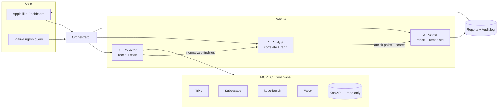

# K8s Sentinel — Build Spec (MVP)

> An autonomous, **self-hosted** AI security agent for Kubernetes. It orchestrates best-of-breed open-source scanners, correlates their findings into ranked attack paths, and ships audit-ready reports — with a clean, Apple-like UI.
>
> **Engine strategy:** build on the **Claude Agent SDK first**, then add a **Hermes Agent** backend for fully air-gapped deployments. The runtime is engine-agnostic by design.

---

## 1. TL;DR

We build **one MVP that contains all eight features**, decomposed into **three specialized agents** behind a thin orchestrator, delivered in **five phases**. The product runs inside the customer's cluster, read-only by default, with a minimal web dashboard.

**The eight MVP features**

1. Multi-scanner orchestration (Trivy · Kubescape · kube-bench · Falco)
2. Correlation engine — siloed alerts → ranked attack paths *(core IP)*
3. Extensive reports (PDF · Markdown · JSON)
4. Plain-English queries over posture
5. Human-on-the-loop remediation (review PRs, never auto-apply)
6. Full audit trail
7. Hardened by design (read-only, sandboxed, untrusted scan input)
8. Sovereign deployment (self-hosted, air-gap capable)

---

## 2. A note on "Claude Code" vs the engine

Two different roles get called "building with Claude" — keep them separate:

| Role | What it is | What we use |
|---|---|---|
| **Dev-time tool** | The thing that writes the product's code | **Claude Code** (CLI) — used to build the whole repo |
| **Runtime engine** | The agent brain that runs *in the customer's cluster* | **Claude Agent SDK** (default) → **Hermes Agent** (air-gap) |

The **Claude Agent SDK** is "Claude Code as a library" — same agent loop, tool execution, and context management, programmable in Python/TypeScript, with built-in MCP and skills support and permission guardrails. Its use is covered by Anthropic's commercial terms for products you ship to customers, and it can run against the Anthropic API or **Bedrock / Vertex / Azure** to keep inference inside a cloud boundary.

- Agent SDK: https://platform.claude.com/docs/en/agent-sdk/overview
- Claude Code: https://docs.claude.com/en/docs/claude-code/overview

**Hermes Agent** (Nous Research, MIT) is model-agnostic and local-first with no telemetry, so it can run a local open-weight model with **zero external calls** — the only option for truly disconnected/classified networks where Claude can't run offline. We add it in Phase 4 behind the same interface.

---

## 3. Architecture — 3 agents + orchestrator



**Why three agents** — the split maps cleanly onto the scan → correlate → report/fix flow, lets us run different models per role (cheap+fast for collection, strong reasoning for correlation), and isolates the high-trust step (correlation/decisioning) from the high-blast-radius step (writes).

> You can collapse to **2 agents** for a leaner MVP by merging Collector + Author and keeping the Analyst standalone. The Analyst (correlation) must always be its own agent — it's the IP.

### Agent 1 — Collector (recon + scan)
- Connects to the cluster with a **read-only** service account.
- Inventories nodes, namespaces, workloads, images, RBAC, network policies, exposed services.
- Runs the four scanners **in parallel** (subagents/tasks).
- Normalizes every output into one **common findings schema** (SARIF-based).
- Model: cost-optimized (`claude-haiku-4-5` or `claude-sonnet-4-6`).

### Agent 2 — Analyst (correlate + rank) — *core IP*
- Consumes normalized findings + cluster context.
- Builds **attack-path narratives** (vuln → running? → exposed? → over-privileged? → reachable secret?).
- **Reranks by reachability/exploitability**, not raw CVSS.
- Maps findings to **CIS / NSA-CISA / SOC 2** controls.
- Answers **natural-language queries** over the posture graph.
- Model: strongest reasoning (`claude-opus-4-7`).

### Agent 3 — Author (report + remediate)
- Generates the layered report → **PDF / Markdown / JSON**.
- Proposes fixes (patched manifests, Kyverno/OPA policies, RBAC tightening) as **reviewable diffs/PRs** — never auto-applies.
- Writes the **immutable audit log** and the **reusable playbook library**.
- Model: `claude-sonnet-4-6`.

### Orchestrator
Thin supervisor: schedules runs (cron + on-demand), fans out to agents, enforces the permission policy, and streams progress to the UI. Holds **no cluster write creds**.

---

## 4. System planes (deployment)

```
┌─────────────────────────────────────────────────────────┐
│ CONTROL PLANE  (hardened pod)                            │
│  • Orchestrator + agent definitions                      │
│  • Permission policy + audit log                         │
│  • NO standing write credentials                         │
└───────────────┬─────────────────────────────────────────┘
                │ scoped, signed task requests
┌───────────────▼─────────────────────────────────────────┐
│ EXECUTION PLANE  (sandbox: gVisor/Kata or sidecar)       │
│  • Where scanners + agent tools actually run             │
│  • Read-only kubeconfig mounted here only                │
│  • Outbound egress allow-listed                          │
└───────────────┬─────────────────────────────────────────┘
                │ MCP / CLI
┌───────────────▼─────────────────────────────────────────┐
│ TOOL PLANE                                               │
│  Trivy · Kubescape · kube-bench · Falco · K8s API (RO)   │
└──────────────────────────────────────────────────────────┘
```

---

## 5. Engine abstraction (the key interface)

Both runtimes implement one interface so the brain is swappable. Build the **Claude adapter first**; the **Hermes adapter** lands in Phase 4.

```typescript
// packages/core/src/engine.ts
export interface AgentEngine {
  /** Run a single agent turn-loop until it produces a typed result. */
  run<TResult>(spec: AgentSpec, input: unknown): Promise<AgentRun<TResult>>;
  /** Stream progress events to the UI / audit log. */
  stream(spec: AgentSpec, input: unknown): AsyncIterable<AgentEvent>;
}

export interface AgentSpec {
  id: "collector" | "analyst" | "author";
  systemPrompt: string;
  model: string;              // engine-specific id
  tools: ToolRef[];           // MCP servers / CLI wrappers
  skills?: string[];          // agentskills.io-style skill packs
  permission: "read-only" | "propose-only" | "approval-required";
}

// Adapters
// packages/engine-claude/   -> wraps @anthropic-ai/claude-agent-sdk
// packages/engine-hermes/   -> wraps Hermes Agent (local model, air-gap)
```

**All IP lives above this line**: the scanner MCP wrappers, the correlation logic, the report templates, the remediation playbooks. The engine underneath is a detail.

---

## 6. Tech stack

| Layer | Choice | Notes |
|---|---|---|
| Agent runtime | **Claude Agent SDK** (TS) → Hermes adapter | engine-agnostic |
| Tool integration | **MCP** servers + thin CLI wrappers | Trivy/Kubescape/kube-bench/Falco |
| Backend/API | **TypeScript + Fastify**, tRPC for UI | streams SSE to dashboard |
| Datastore | **SQLite (MVP)** → Postgres | findings, runs, audit log |
| Frontend | **Next.js (App Router) + TypeScript + Tailwind** | see §8 |
| UI kit | **shadcn/ui + Radix**, `framer-motion`, Recharts | Apple-like primitives |
| Packaging | **Helm chart**, distroless images | one-command install |
| Sandbox | gVisor / Kata containers | execution plane isolation |

---

## 7. Repo structure (monorepo)

```
k8s-sentinel/
├── CLAUDE.md                 # how Claude Code should work in this repo
├── apps/
│   ├── dashboard/            # Next.js — Apple-like UI
│   └── api/                  # Fastify + tRPC orchestrator API
├── packages/
│   ├── core/                 # engine interface, findings schema, types
│   ├── engine-claude/        # Claude Agent SDK adapter (DEFAULT)
│   ├── engine-hermes/        # Hermes adapter (Phase 4, air-gap)
│   ├── agent-collector/      # Agent 1 spec + tools
│   ├── agent-analyst/        # Agent 2 spec + correlation skill
│   ├── agent-author/         # Agent 3 spec + report/remediation
│   └── tools-mcp/            # Trivy/Kubescape/kube-bench/Falco MCP servers
├── deploy/helm/              # chart, RBAC (read-only), sandbox policy
└── docs/
```

---

## 8. UX/UI — Apple-like, content-first

**Design principles** (deference, clarity, depth):

- **Defer to content.** The UI gets out of the way. One screen does one job. No dashboards-of-everything.
- **Generous whitespace**, large type hierarchy, no visual clutter, no decorative chrome.
- **System font stack** (SF Pro on Apple, Inter elsewhere). Title 32–40px, body 15–17px.
- **Restrained palette.** Near-neutral surfaces; **one accent**. Semantic color only where it carries meaning: green = clear, amber = warning, red = critical.
- **Soft depth** — subtle shadows, translucent "material" panels, **continuous-corner** rounding (`rounded-2xl`).
- **Calm motion** — short, eased transitions (`framer-motion`, 150–250ms). Nothing bouncy.
- **Progressive disclosure** — overview first, drill down on intent. Light + dark mode, identical layout.

**Design tokens (starter)**

```
--bg            #FBFBFD (light) / #0B0B0F (dark)
--surface       #FFFFFF / #1C1C1E
--text          #1D1D1F / #F5F5F7
--muted         #6E6E73
--accent        #0A84FF        (single brand accent)
--clear         #34C759   --warn #FF9F0A   --critical #FF3B30
radius          16px      shadow  0 8px 30px rgba(0,0,0,.06)
```

**Key screens (MVP)**

1. **Overview** — a single large **risk-score ring**, posture trend line, and "what changed since last scan." Calm by default.
2. **Findings** — clean, prioritized list (ranked by exploitability, not CVSS). Filterable, no noise.
3. **Attack Path** — focused detail view; the correlated chain shown as a simple node graph.
4. **Ask** — a **Spotlight-style** command bar for plain-English queries ("show everything internet-exposed running as root").
5. **Report** — readable report view with one-tap export (PDF/MD/JSON).
6. **Fixes** — proposed remediations as review cards; approve → opens a PR. Nothing applies silently.

---

## 9. Data model (sketch)

```typescript
type Finding = {
  id: string;
  source: "trivy" | "kubescape" | "kube-bench" | "falco";
  severity: "critical" | "high" | "medium" | "low";
  resource: ResourceRef;        // ns/kind/name/image
  raw: unknown;                  // original tool output
  // enriched by the Analyst:
  reachable?: boolean;           // actually running + exposed?
  exploitScore?: number;         // 0–100, reachability-weighted
  attackPathId?: string;
  controls?: string[];           // CIS / NSA-CISA / SOC2 mappings
};

type AttackPath = {
  id: string;
  narrative: string;             // human-readable chain
  steps: ResourceRef[];
  score: number;
  findingIds: string[];
};

type AuditEntry = {              // immutable
  ts: string; actor: "agent" | "user";
  agent?: AgentSpec["id"];
  action: string; tool?: string; input: unknown; output: unknown;
};
```

---

## 10. Security model (non-negotiable)

- **Read-only by default.** Scanning never needs write. RBAC ships locked down.
- **Untrusted scan input.** Image tags, annotations, CVE text → treated as hostile; sanitized before entering any agent context (prompt-injection defense).
- **Sandbox separation.** Agent reasoning (control plane) is isolated from command execution (execution plane). Credentials live only in the sandbox.
- **Propose, don't apply.** All writes are PRs requiring human approval.
- **Everything is logged.** Every agent decision, tool call, and command in the immutable audit log.
- **Egress allow-list.** Outbound traffic restricted; in air-gap mode (Hermes), zero external calls.

---

## 11. Phased build plan

Each phase is shippable and has a **Definition of Done (DoD)**. Build with Claude Code phase by phase.

### Phase 0 — Foundations
- Monorepo, CI, `CLAUDE.md`, lint/test.
- `packages/core`: engine interface + findings schema + types.
- **Claude Agent SDK** wired up in `engine-claude` (hello-world agent turn).
- Read-only RBAC manifest + sandbox skeleton in `deploy/helm`.
- **DoD:** a trivial agent runs through the Claude adapter and writes one audit entry.

### Phase 1 — Agent 1: Collector (Features 1, 7-foundation)
- Cluster connect (read-only) + inventory.
- MCP/CLI wrappers for Trivy, Kubescape, kube-bench, Falco in `tools-mcp`.
- Parallel scan run → normalize to `Finding[]`.
- **DoD:** `sentinel scan` produces a normalized, persisted findings set from all four tools.

### Phase 2 — Agent 2: Analyst (Features 2, 4)
- Correlation skill: build `AttackPath[]`, compute `exploitScore`, set `reachable`.
- Compliance mapping (CIS/NSA-CISA/SOC 2).
- Natural-language query endpoint over the findings/path graph.
- **DoD:** findings are reranked by reachability; "show internet-exposed running as root" returns correct results.

### Phase 3 — Agent 3: Author + UI (Features 3, 5, 6)
- Report generation → PDF/MD/JSON.
- Remediation proposals as reviewable diffs/PRs.
- Immutable audit log + playbook library.
- **Apple-like dashboard** (the 6 screens) wired to the API over SSE.
- **DoD:** end-to-end: trigger scan in UI → see ranked findings + attack paths → export report → approve a fix as a PR.

### Phase 4 — Hardening + Sovereignty (Features 7, 8) + **Hermes**
- Prompt-injection hardening on scan input; sandbox separation enforced; egress allow-list.
- Helm chart polish → one-command install.
- **`engine-hermes` adapter**: same interface, local open-weight model, zero egress → air-gap mode.
- **DoD:** identical product runs in two modes — Claude SDK (default) and Hermes (air-gapped) — selectable by config, with no change to agents/IP.

> **This is the MVP.** All eight features are present by end of Phase 3 (Claude) / Phase 4 (air-gap + hardening).

---

## 12. Feature → phase matrix

| # | Feature | Agent | Phase |
|---|---|---|---|
| 1 | Multi-scanner orchestration | Collector | 1 |
| 2 | Correlation engine *(IP)* | Analyst | 2 |
| 3 | Extensive reports | Author | 3 |
| 4 | Plain-English queries | Analyst | 2 |
| 5 | Human-on-the-loop fixes | Author | 3 |
| 6 | Full audit trail | Author + Orchestrator | 3 |
| 7 | Hardened by design | all | 0 → 4 |
| 8 | Sovereign / air-gap | engine-hermes | 4 |

---

## 13. Driving this with Claude Code

1. **Seed the repo** with this file as `docs/BUILD.md` and create a `CLAUDE.md` pointing to it (architecture, conventions, "read-only by default", "never auto-apply writes", test/lint commands).
2. **Work one phase at a time.** Give Claude Code the phase's DoD as the goal; let it scaffold, implement, and self-verify against acceptance criteria before moving on.
3. **Keep the engine boundary sacred** — instruct Claude Code that no agent/IP code may import from `engine-claude` or `engine-hermes` directly; only via `packages/core`.
4. **Per-phase prompt shape:** *"Implement Phase N from docs/BUILD.md. Honor the security model in §10. Produce the DoD. Add tests. Don't touch other phases."*
5. Use subagents/parallel tasks in Claude Code for the four scanner wrappers (independent, parallelizable).

---

## 14. Out of scope for MVP (future)

- Multi-cluster fleet view; CI/CD admission gate; drift alerting.
- Auto-remediation (beyond proposed PRs).
- SaaS/multi-tenant mode (MVP is single-cluster, self-hosted).
- Signed-skill provenance / SLSA supply-chain attestation (fast-follow for regulated buyers).

---

## 15. Key risks

- **Thin-wrapper perception** — mitigated by making correlation/exploitability the visible product, not the scans.
- **Agent-as-attack-surface** — mitigated by read-only default, sandbox, untrusted-input handling, audit log.
- **Hermes maturity** — isolated behind the engine interface; Claude SDK carries the default path.

---

## 16. Getting started (Phase 0)

```bash
npx create-turbo@latest k8s-sentinel   # or pnpm workspaces
cd k8s-sentinel
pnpm add @anthropic-ai/claude-agent-sdk
# scaffold packages/core, engine-claude, then open in Claude Code:
claude   # then: "Implement Phase 0 from docs/BUILD.md"
```

*Verify current SDK package name, models, and Helm/RBAC details against the live docs before pinning versions:*
*https://platform.claude.com/docs/en/agent-sdk/overview · https://docs.claude.com/en/docs/claude-code/overview*
